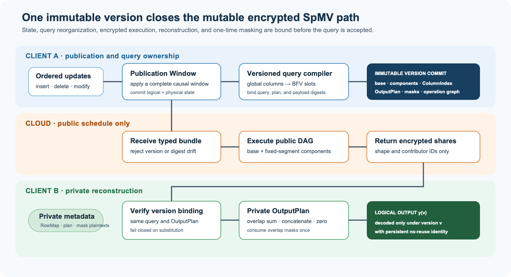
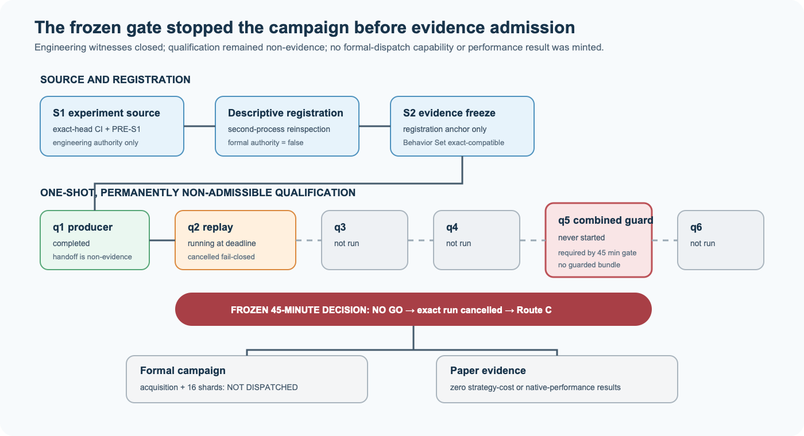

# Version-Bound Maintenance for Mutable Homomorphic Sparse Matrix--Vector Multiplication: A Fail-Closed Evaluation Boundary

> **Manuscript status:** Route C methods/boundary working draft. The frozen
> engineering lineage is complete, but the one-shot qualification selected the
> preregistered stop route. No comparative performance, complete-reference,
> security, or end-to-end claim is released. Evidence status last synchronized:
> 2026-08-30.

## Abstract

Compressed sparse layouts make homomorphic sparse matrix--vector multiplication
practical for static patterns, but updates also change value placement, query-
reorganization metadata, and encrypted-output-to-row mappings. Full
recompression at each freshness boundary can dominate update cost; auxiliary
components trade publication work for query work and observable structure.

We present an update-aware layer around the published Compressed Sparse Sorted
Column (CSSC) representation. Freshness-bounded Publication Windows bind each
query to an immutable matrix version, global-column metadata, and a private
RowMap-sensitive reconstruction plan. For multi-component layouts, the plan
distinguishes overlaps from disjoint blocks and drives overlap-scoped one-time
zero-sum masking with persistent no-reuse bindings. A fixed-segment delta lets
the Cloud execute a public page-wide schedule while the client privately merges
segment leaders. A typed bundle binds the CSSC base, delta, operands, routes,
and operation graph and fails closed on version or plan substitution.

Our evaluation protocol compares three fixed maintenance mechanisms under the
same versioned event streams, query schedules, public parameters, and initial
states. It separates directly measured state-transition costs, exact typed
operation counts, type-derived serialized-byte bounds, a narrowly registered
query-linearity projection, and native OpenFHE observations. The frozen matrix
contains six synthetic shards, four ordered-event shards derived from one SNAP
source object, and six native OpenFHE cases. Independent replay and terminal
admission must accept exactly the resulting 17 pre-aggregate artifacts before
analysis can release any empirical sentence.

The sole preregistered, permanently non-admissible qualification did not reach
its combined guard within the frozen computational deadline. The external
controller cancelled only that exact run, no formal-dispatch capability was
created, and the acquisition and 16-unit formal campaign were therefore not
started. We report the protocol, its definition-level functional obligations,
the source/evidence separation, and this fail-closed evaluation boundary. We do
not convert partial qualification execution into strategy-cost or native-
OpenFHE performance evidence.

**Keywords:** homomorphic encryption; sparse matrix--vector multiplication;
mutable sparse matrices; cryptographic engineering; reproducible evaluation

## 1. Introduction

Encrypted sparse linear algebra sits at an awkward boundary between cryptography
and data layout. Homomorphic encryption hides values but makes data movement and
permutation expensive. Sparse formats reduce arithmetic on zeros, yet they also
turn a matrix's support into layout metadata and require a client to align the
encrypted query with physical value lanes. CSSC addresses the static case by
sorting rows, packing capacity-fitting rectangles, and retaining the metadata
needed to recover logical outputs. Its own stated limitation is a static sparse
pattern [@gao2026cssc].

A mutable matrix cannot be handled by changing values alone. An insertion may
consume padding, create an overflow component, change a row permutation, or force
new query-reorganization metadata. A deletion may leave reusable physical
capacity without changing the logical matrix dimension. Meanwhile, a query must
not combine a new matrix component with an old column-index array or reconstruct
shares using a plan from another version. These are system-level consistency
requirements, not details of the underlying homomorphic primitive.

The naive policy republishes a fully recompressed CSSC layout after every batch.
Alternative policies retain slack, patch local regions, append a delta, or
periodically fold auxiliary state into the base. Their relative merit depends on
the update/query ratio, freshness deadline, layout history, communication
bandwidth, and the exact encrypted output path. Evaluating each window from a
fresh initial layout, selecting with held-out information, or omitting returned
ciphertexts and masking work can reverse the apparent ranking.

This paper therefore asks a narrower, auditable question: how should mutable
CSSC state be published, queried, reconstructed, and compared without breaking
version semantics or overstating evidence?

### Contributions

1. **Version-bound publication semantics.** We define Publication Windows and a
   commit rule that binds logical state, CSSC components, global-column query
   metadata, the reconstruction plan, and prepared queries to one version.
2. **Explicit multi-component reconstruction.** We introduce a private
   RowMap-sensitive `OutputPlan` that distinguishes overlap summation, disjoint
   block concatenation, and implicit zeros.
3. **Scoped masking integration.** We derive overlap-only F1-M operands from the
   plan and bind every random mask to a persistent, reserve-before-sample
   five-field identity. The underlying canceling-mask idea is prior art; the
   contribution claimed here is its versioned CSSC integration.
4. **A designated strong fixed-segment reference path.** We define public fixed-width
   segment/page shapes, cloud-side leader reduction, private leader merging, and
   a deterministic whole-query execution bundle. We do not claim a new HE
   primitive or a formal security proof.
5. **Causal, fail-closed evaluation.** We freeze three strategy identities rather
   than train an online selector, advance independent states through identical
   deterministic streams, separate measured and projected quantities, and bind
   every reportable claim to independently replayed, digest-addressed evidence.

## 2. Background and Related Work

### 2.1 Static encrypted sparse matrix--vector multiplication

CSSC is the direct substrate of this work and must be credited for row sorting,
left-aligned sparse rectangles, `Value`, global `ColumnIndex`, `RowMap`, chunked
query reorganization, and static aggregation [@gao2026cssc]. Our implementation
is an independent pseudocode-derived reconstruction; we did not use or verify
an author implementation. Static encrypted sparse linear algebra already spans
Lodia's low-diagonal SpMV [@yu2025lodia], CipherSkip's encrypted-value-and-index
arbitrary-shape SpGEMM [@xiong2026cipherskip], diagonal-packing reordering
[@mutluergil2026diagonal], ciphertext--ciphertext SpMSpM on CPU and GPU
[@ferguson2025unstructured; @dagata2026gpu], and the encrypted-index
Scatter--Gather--Apply design reported by the public SparseE program abstract
[@wei2026sparsee]. Rhombus separately shows plaintext-matrix/encrypted-vector
two-party MVM with additive output shares [@he2024rhombus]. These works rule out
broad claims of first encrypted indices, first sparsity-aware FHE multiplication,
first ciphertext--ciphertext sparse multiplication, or first use of random
sharing to split an MVM output.
Our claimed gap is the narrower mutable CSSC publication and reconstruction
contract; it is not a new static packing or cryptographic primitive.

Our source audit of CSSC [@gao2026cssc] finds a non-power-of-two ambiguity in
the printed aggregation pseudocode. We use a
corrected `totalSum`-compatible stored-power/prefix graph that preserves the
paper-derived abstract count
`floor(log2 w) + popcount(w) - 1`. We present this as a compatibility correction,
not as a new aggregation algorithm or verified author-code behavior; the
`totalSum` connection is grounded in the HElib SIMD reduction literature
[@halevi2014algorithms].

The closest methods are not interchangeable experimental baselines:

| Work | Principal representation or setting | Mutable support? | Relation to this paper |
|---|---|---:|---|
| CSSC [@gao2026cssc] | Sparse-coordinate compression with `ColumnIndex`/`RowMap` | No | Direct static substrate; its published layout and reorganization are not our contribution. |
| Lodia [@yu2025lodia] | Low-diagonal decomposition for batched FHE SpMV | Not described | Establishes earlier sparsity-aware encrypted SpMV; different decomposition and leakage/cost interface. |
| CipherSkip [@xiong2026cipherskip] | Encrypted values and indices for arbitrary-shape SpGEMM and chained products | No matrix-state publication protocol | Its server-side alignment concerns encrypted intermediate products, not insert/delete/update of a published sparse layout. |
| SparseE [@wei2026sparsee] | Encrypted-index Scatter--Gather--Apply with a permutation/expansion accelerator | Not established by the public abstract | Establishes an encrypted-index hardware co-design boundary; as of 2026-08-30, no public full text, DOI, or public software repository was located. |
| Diagonal Packing [@mutluergil2026diagonal] | Row/column reordering to reduce occupied cyclic diagonals | Not described | HE-aware static compiler optimization; no mutable CSSC publication or reconstruction is described. |
| Ferguson et al. [@ferguson2025unstructured] | CKKS ciphertext--ciphertext SpMSpM with public sparse metadata | Not described | Demonstrates prior FHE sparsity exploitation under a PPML workload; different operation, scheme, and small square matrices. |
| D'Agata et al. [@dagata2026gpu] | GPU/FIDESlib CKKS ciphertext--ciphertext SpMSpM with public sparse metadata | Not described | Extends the same static design space to GPU execution; a dynamic SpMV publication protocol is not described. |
| Rhombus [@he2024rhombus] | Plaintext-matrix/encrypted-vector MVM with additive output shares | Not described | A different two-party PPML protocol; the random-share primitive is prior art, while versioned overlap binding is our narrower integration claim. |
| Damie et al. [@damie2025secure] | Secret-shared sparse matrix multiplication in MPC | Not described | Shows secure sparse arithmetic outside FHE; incomparable without a common threat and cost model. |
| This work | Version-bound CSSC base plus designated maintenance components; formal evaluation stopped at qualification | Yes | Studies publication, query recompilation, private reconstruction, and causal-cost contracts; claims no static-format, primitive, or comparative-performance novelty. |

### 2.2 Mutable sparse layouts

Reserved slack, padding reuse, COO/HYB overflow, row-local growth, base/delta
organization, periodic compaction, and format selection all have substantial
plaintext sparse-matrix and storage-system precedent, including SELL-C-sigma
[@kreutzer2014sellcsigma], GPU HYB/COO practice [@bell2008spmvcuda], LSM-trees
[@oneil1996lsm], Dynamic-CSR [@king2016dynamiccsr], and dynamic format selection
[@stylianou2022morpheus]. They are comparison families in this paper, not
independent novelty claims. Our narrower concern is their interaction with
encrypted query preparation, version consistency, private reconstruction, and
complete cost accounting.

### 2.3 Dynamic encrypted data systems and masking

Dynamic SSE, encrypted databases, ShieldDB, and oblivious transaction systems
already study updates, client state, epochs, padding, and leakage
[@cash2014dynamic; @vo2021shielddb; @crooks2018obladi]. They do not instantiate
the same ciphertext--ciphertext CSSC query, but they prevent broad claims that
batching or versioned updates are new. d-DSE directly shows that
update-volume leakage remains a separate problem and that padding can impose
large storage and communication costs [@liu2024ddse]. CKKS-Auth Tree uses
versioned root commitments and timestamps to detect stale or replayed
verification objects after encrypted-metadata updates
[@chen2026ckksauthtree]. Neither work implements mutable SpMV, but together they
rule out novelty claims for volume hiding, versioned commitments, freshness
checks, or replay rejection in isolation. Fixed segments, dummy work, and
visible schedules are therefore described through an explicit leakage surface,
not as a generic update-leakage solution.

Canceling one-time masks also predate this work [@bonawitz2017secureagg]. We
therefore state the exact leakage and recipient roles and avoid the terms
`simulation-secure` or `prevents leakage` without a separate proof. Authorized
homomorphic database
updates also predate this work and delimit any claim about encrypted mutability
[@parbat2023authorized].

## 3. System and Threat Model

The system has Client A, which owns the mutable matrix; Client B, which owns the
query and secret key and receives the result; and a semi-honest Cloud evaluator.
At most one party is corrupted and the Cloud does not collude with either client.
The model excludes malicious behavior, adaptive corruption, availability,
side-channel, traffic-analysis, and collusion claims.

Client B is authorized to learn the versioned global column indices, component
RowMaps, complete reconstruction plan, and final result. The Cloud is authorized
to learn public parameters, ciphertext shapes and counts, public page/segment
shapes, the operation schedule, opaque identifiers, query/version identifiers,
and plan digests. The interface classifies matrix/query plaintexts, global
column metadata, RowMaps, full plans, mask plaintexts, and unblinded component
outputs as forbidden-to-Cloud fields, and the typed serializers do not emit
them. This is an access-control and serialization requirement, not a proof that
all leakage is prevented or that the implementation realizes a
simulation-based notion.

## 4. Design

Figure 1 shows the protocol boundary. Client A owns publication and constructs
the version commit; the Cloud receives only the typed public program; Client B
uses the matching private plan to recover logical coordinates. The diagram is
an interface summary, not a claim that the listed metadata is
cryptographically hidden from every side channel.

{width=6.3in}

### 4.1 Publication Windows

Updates accumulate until a query arrival, freshness deadline, microbatch bound,
or explicit publication event closes the current window. The transition first
applies every net update to a candidate logical state, validates matrix and value
bounds, constructs or patches physical components, decodes them back to the same
logical state, and only then publishes the next version. A failed transition
cannot partially advance the visible state.

For the publication experiment, accepted raw events form atomic scheduling
groups. All visible SET transitions are applied first, followed by a payload-free
logical clock TICK and then the group's exactly scheduled queries. The TICK is
emitted even for clipped no-ops, so freshness advances without fabricating an
update. Before a group at logical time `t` is processed, any pending half-open
window whose deadline is at or before `t` is closed; the deadline group therefore
belongs to the next window. No close may split the group's SET→TICK→query
sequence. One deterministic bound-one ternary query vector is frozen per paired
trace unit and reused across candidates and cells. Its seed, generation method,
and values are public, so it is a known-answer correctness/cost control rather
than evidence for a production-query distribution, cryptographic randomness, or
query-plaintext confidentiality.

### 4.2 Versioned query reorganization

Each CSSC value lane is paired with a parallel original matrix-column identifier
or a padding sentinel. Client A sends versioned plaintext column metadata to
Client B. Client B gathers one aligned vector per encrypted value chunk and
encrypts it. The
matrix column domain is independent of the ciphertext-slot domain; reducing a
global column identifier modulo the slot count changes the function and is
forbidden.

### 4.3 OutputPlan and F1-M

The plan maps `(component, output block, physical lane)` to a logical output
coordinate. Client B initializes the public-length result to zero, reorders each
decrypted share, sums only equal logical coordinates, and concatenates disjoint
horizontal blocks. A coordinate with no physical contributor is an implicit
zero.

For contributor multiplicity greater than one, Client A samples a modular
zero-sum mask tuple. The binding
`(query, version, plan digest, component, output block)` is reserved in the
durable SQLite ledger before sampling. Duplicate use is rejected within that
ledger model. Repository rollback, database cloning or compromise, and
cross-device coordination are outside the present evidence. A disjoint strong-path return uses an
encrypted-zero dummy to retain a uniform visible operation position; it is not a
random mask and is accounted separately.

### 4.4 Strong fixed-segment delta

The strong path retains a real CSSC base and places overflow into fixed-width
power-of-two segments, currently frozen to `c=128`. A segment contains entries
from one logical row. The public typed plan uses uniform shapes and opaque
ordinal IDs, while the Cloud-visible leakage also includes published counts,
schedule and timing, query/version identifiers, and binding digests. We do not
claim segment unlinkability.
The Cloud multiplies aligned value/query ciphertexts, applies the fixed reduction
schedule, selects segment leaders, adds one F1-M operand per return, and returns
page shares. Client B uses the private plan to merge leaders that map to the same
logical row.

The current policy does not authorize cloud-side merging of segments that share
a logical row. Same-row-equivalence fields are carried only in Client B's typed
plan; this is an interface access-control requirement, not a proof that segment
relationships cannot be inferred. The publication identity for
folding/compaction is frozen separately; changing it creates a different
candidate.

The segment width 128 is fixed before real-stream evaluation rather than tuned:
it yields a seven-stage power-of-two reduction, places 32 complete segments in
the 4,096-lane effective domain, and is the exact 127-active-plus-one-padding
boundary covered by the pinned witness. We make no optimality or
cross-segment-width claim.

### 4.5 Definition-level functional propositions

The following statements are conditional functional propositions about the
frozen typed interfaces and algorithms. They are not empirical conclusions and
not a malicious- or simulation-security theorem. The exact-S1
source-conformance record maps every premise below to the corresponding
validator, state transition, reconstruction routine, or ledger transition; the
registered tests exercise legal cases and substitutions but do not replace the
proof arguments.

#### P1: binding soundness

For publication version $v$, let

$$
\mathcal{P}^{(v)}=
\left(
A^{(v)},
\{C_k^{(v)}\}_{k=1}^{K_v},
\{CI_k^{(v)}\}_{k=1}^{K_v},
\{RM_k^{(v)}\}_{k=1}^{K_v},
O^{(v)},Q^{(v)},B^{(v)}
\right),
$$

where $A$ is the logical matrix, $C_k$ are ordered physical components,
$CI_k$ and $RM_k$ are their global-column and row mappings, $O$ is the private
OutputPlan, $Q$ is the prepared-query binding, and $B$ is the immutable typed
identity and digest bundle. Let $B^{(v,q)}$ be the authoritative binding for
query $q$. The registered acceptance predicate has the shape

$$
\operatorname{Accept}(X;B^{(v,q)})=
\bigwedge_{f\in\mathcal{F}}[X_f=B_f^{(v,q)}]
\;\land\!
\bigwedge_{o\in\mathcal{O}}
[\operatorname{SHA256}(\operatorname{bytes}_X(o))=B_o^{(v,q)}],
$$

where $\mathcal{F}$ enumerates every typed version, query, component, mapping,
plan, parameter, and execution identity, and $\mathcal{O}$ enumerates every
retained canonical byte object. Hence acceptance implies equality for every
enumerated field and rehashed object. The capability and formal-artifact paths
are downstream of this conjunction, so a failed conjunct cannot mint them.

The proof is a case analysis over the closed predicate: each field class occurs
as a necessary conjunct, retained bytes are rehashed inside the private
admission process, and no earlier branch reaches the issuer. This establishes a
functional binding property for ordinary inputs and malformed/stale
substitutions. It says nothing about deliberate SHA-256 collisions, compromised
hosts, or side channels.

#### P2: multi-component reconstruction

Let $A_k^{(v)}$ be component $k$ in its local physical coordinates and $E_k$
its embedding into the logical matrix domain. The admitted decomposition is
complete when

$$
A^{(v)}=\sum_{k=1}^{K_v}E_k\!\left(A_k^{(v)}\right)\pmod t.
$$

Assume each component execution decrypts to $A_k^{(v)}x$ in its declared lanes,
every lane has exactly its declared logical coordinate, the OutputPlan is total,
and P3 masks cancel. For logical row $r$, the reconstruction operator sums all
contributors mapped to $r$, places disjoint blocks in logical order, and uses
zero when the contributor set is empty. Therefore

$$
R_{O^{(v)}}\!\left(\{A_k^{(v)}x\}_{k=1}^{K_v}\right)_r
=\sum_{k=1}^{K_v}\left(E_k(A_k^{(v)})x\right)_r.
$$

By completeness of the admitted decomposition,

$$
\sum_{k=1}^{K_v}\left(E_k(A_k^{(v)})x\right)_r
=\left(A^{(v)}x\right)_r\pmod t.
$$

The equality is coordinatewise: overlap is ordinary addition in
$\mathbb{Z}_t$, disjoint blocks have disjoint images under the embeddings, and
an unmaterialized row contributes the additive identity. It holds for any
admitted number of components under the stated completeness and totality
premises; the finite tests only check the implementation of those premises.

#### P3: mask cancellation and ledger-scoped no-reuse

For an overlap group $G_r=(k_1,\ldots,k_g)$ in canonical contributor order with
$g\ge 2$, Client A samples

$$
m_{r,k_1},\ldots,m_{r,k_{g-1}}
\overset{\mathrm{u.a.r.}}{\leftarrow}\mathbb{Z}_t,
\qquad
m_{r,k_g}=-\sum_{i=1}^{g-1}m_{r,k_i}\pmod t.
$$

Thus $\sum_{k\in G_r}m_{r,k}=0\pmod t$, and P2 reconstruction removes the
random operands without changing the logical output coordinate. Groups of size
zero or one receive no random tuple; an encrypted-zero dummy is a separate
accounted object.

For no-reuse, the durable state machine is

$$
\textsf{unseen}\rightarrow\textsf{reserved}
\rightarrow\textsf{prepared}\rightarrow\textsf{consumed}.
$$

One transaction reserves every five-field key
`(query, version, plan digest, component, output block)` before the first random
sample. A prepared batch additionally binds the private plan, execution binding,
modulus, operand commitments, and a unique token; verification consumes that
token atomically. Uniqueness constraints plus exact terminal closure reject a
duplicate key or token, commitment drift, orphan record, or second consumption.
The evaluation-lane digest includes the unit-attempt ordinal, so the single
provider-replacement allowance cannot reuse the same reservation identity. This
is an invariant of one uncompromised durable SQLite ledger, not a rollback,
cloning, compromise, or cross-device guarantee.

#### P4: fixed-segment reconstruction

For a logical row $r$, partition its auxiliary entries in canonical order into
$J_r$ segments $S_{r,1},\ldots,S_{r,J_r}$ of $c=128$ lanes and pad only the
final unused suffix with zeros. The seven-stage public reduction places

$$
L_{r,j}=\sum_{\ell=0}^{127}S_{r,j}[\ell]
$$

in the predetermined leader lane. The private OutputPlan maps every leader back
to $r$, so Client B obtains

$$
\sum_{j=1}^{J_r}L_{r,j}
=\sum_{j=1}^{J_r}\sum_{\ell=0}^{127}S_{r,j}[\ell],
$$

which is exactly the auxiliary contribution to row $r$; adding the CSSC-base
contribution and applying P2 gives the direct logical product. The proof is an
induction on $J_r$: one segment is the fixed reduction identity, and appending a
row-owned segment adds exactly its leader sum without changing prior leaders.
The 127/128/129, tombstone, padding, disjoint, and overlap cases are boundary
tests of this construction, not its general proof and not evidence that 128 is
an optimal width.

## 5. Implementation and Evidence

At historical baseline commit `fcb00e0d`, the Python implementation supplied typed persistent states, a common query
compiler, exact operation graphs, private operand/route bindings, a plaintext
oracle, SQLite no-reuse commitments, canonical artifacts, and a separate deterministic replay
validator. The encrypted path uses BFV-family batching, whose original scheme
lineage is Fan--Vercauteren [@fan2012somewhat], through OpenFHE 1.5.1 pinned by
source commit [@openfhe151].

At that historical baseline, R0 passed 750 tests and the Phase 2 whole-query witness
passed in run `32581653504`. The witness exercises a 4096-by-8193 fixture,
global-column anti-aliasing, the 127-of-128 segment boundary, the unused second
BFV batching row, explicit no-relinearize/relinearize transitions, random and
dummy F1-M operands, and equality with both typed and direct plaintext oracles.
Its GitHub Actions artifact-wrapper SHA-256 digest is
`c5f44b0c9475a66d49b48332e335cb58811cf4eec579ebff631123c4e4711afe`.

This evidence is deliberately narrow. It does not establish complete candidate
costs, candidate registration, mixed-circuit parameter safety, security,
performance, or an end-to-end deployment.

**Table 1. Definition-level obligations and their Route C disposition.**

| Obligation | Frozen implementation and review boundary | Claim permitted in this manuscript |
|---|---|---|
| P1: exact binding | Typed version/query/plan/payload identities, fresh byte rehashing, independent replay, and source-conformance mapping | Conditional binding proposition and fail-closed interface design; no end-to-end admission claim |
| P2: multi-component reconstruction | Private `OutputPlan`, direct plaintext oracle, overlap/concatenation/implicit-zero checks | Definition-level reconstruction proof under the admitted-plan premises; no formal-run result |
| P3: F1-M cancellation and no-reuse | Modular cancellation proof plus durable reserve-before-sample SQLite state machine | Cancellation and ledger-local invariant only; no simulation-security, rollback, cloning, or cross-device claim |
| P4: fixed 128-lane segment path | Seven-stage reduction proof and 127/128/129 boundary tests | Correctness proposition for the frozen segment construction; no optimal-width or performance claim |
| Evidence release | S1/S2 Behavior Sets, independent guards, terminal controller, and exact object-count contract | Engineering/source conformance and the Route C stop decision only; no strategy-cost evidence |

The Route A engineering line retains those boundaries while adding a closed
qualification and evidence path. A six-job, permanently non-admissible
qualification first exercises a synthetic producer/replay pair, then a
case-shaped native producer with one discarded warm-up and three fresh-key
recorded lanes, exact package replay with zero key generation and zero
encryption, a cross-domain combined guard, and a post-run resource record. Its
artifacts have one-day retention, carry no publication authority, and can never
enter the paper's formal result set. An external controller enforces the frozen
computational and end-to-end deadlines and can only return a non-serializable,
short-lived dispatch capability after a fresh provider reread.

Formal execution was specified as a separate strictly serial campaign,
conditional on qualification success. Every unit would have had an
experiment-source checkout, producer,
one-day non-evidence handoff, independent replay, guard, and formal artifact.
The terminal validator admits exactly one acquisition artifact, six synthetic
artifacts, four ordered-event artifacts, and six native artifacts before one
aggregate and a compatible detached analysis snapshot may be created. A clean
source snapshot, a data-only registration snapshot, and an analysis snapshot
may have different commit identifiers only when a repository-owned closed
Behavior Set and compatibility receipt prove that every behavior-bearing blob
remains identical where required. The qualification did not succeed, so none of
these formal units or downstream objects was created.

Historical exact-head CI and real-runner smokes are useful engineering
observations, but they do not transfer across behavior changes. The final
reviewed tree was merged as Experiment Source Snapshot S1
`ee58627bb5752c6ac1ee2c5132c6574f9cb66552`; exact-main CI and PRE-S1 passed.
A descriptive registration was then installed as the only data change in
Evidence-Freeze Snapshot S2
`c7ff6820d9323f1850c1c5c57fd9070db88db120`, whose CI and closed-Behavior-Set
compatibility checks passed. The sole qualification subsequently selected
Route C, so the formal campaign, terminal admission, aggregate, and analysis
chain were deliberately not run. No statement in this section is empirical
evidence for a maintenance strategy.

Generative-AI systems assisted literature discovery, code and test generation,
adversarial review, and drafting during development. Their outputs are neither
source authority nor experimental evidence. Human authors must independently
verify cited primary sources, inspect the final code, reproduce the admitted
artifacts, and accept responsibility for every claim and released result.

## 6. Evaluation Methodology

The experiment is frozen before any formal artifact is inspected. It does not
train a selector, choose a winner on a tuning prefix, or use a held-out oracle.
Every strategy owns an independent persistent state and consumes the same
ordered event groups, publication boundaries, queries, initial logical matrix,
and public parameters. The intervention is therefore the maintenance mechanism,
not the workload history.

### 6.1 Fixed strategies

The three strategy identities are:

1. `periodic-repack/windows=1`, which reconstructs and republishes a complete
   static CSSC layout at every Publication Window;
2. `padding-reuse`, which reuses the lowest-ordinal tombstone, then natural
   padding, and otherwise rebuilds the affected fixed horizontal row partition;
   and
3. `packed-coo-cloud-segmented-delta/segment-width=128`, which keeps a CSSC base
   and appends overflow into cloud-executable, row-owned 128-lane segments. It
   never folds online in the registered experiment.

These candidates are mechanisms to compare, not actions of an online policy.
A slower strategy, a crossing cost curve, or the absence of a global winner is
a reportable outcome rather than a failed experiment.

### 6.2 Synthetic matrix

The synthetic suite uses a mixed insert/delete/modify workload at two frozen
scales: S has 256 rows, 8,193 columns, and 512 accepted updates; M has 1,024
rows, 8,193 columns, and 2,048 accepted updates. The formal seeds are
`20260822`, `20260823`, and `20260824`, giving six scale--seed shards. Every
shard evaluates all three strategies at
$\rho\in\{0.01,0.1,1,10\}$.

For a reduced fraction $\rho=p/q$ and zero-based accepted-event ordinal $a$,
the number of queries inserted after event group $a$ is

$$
Q_a=
\left\lfloor\frac{(a+1)p}{q}\right\rfloor-
\left\lfloor\frac{ap}{q}\right\rfloor,
$$

so the first $N$ complete groups contain exactly

$$
\sum_{a=0}^{N-1}Q_a=\left\lfloor\frac{Np}{q}\right\rfloor
$$

queries. The $0.01$, $0.1$, and $1$ cells execute directly. The $\rho=10$
cell is not timed; it is an exact registered transformation of the same
strategy and shard's $\rho=1$ query-linear count and byte fields. Any event,
window, state, or non-whitelisted-field mismatch rejects the entire shard.

### 6.3 Ordered events from one real source

The sole external object is the SNAP Stack Overflow answer-to-question stream
`sx-stackoverflow-a2q.txt.gz`
[@snap_stackoverflow_temporal_network; @paranjape_motifs_in_temporal_networks].
Acquisition records the final URL, response headers, exact compressed length,
and SHA-256 digest. An independent guard downloads the object again and
requires identical response-body bytes; the admitted artifact omits the raw
compressed object.

The first 1,000,000 eligible records freeze the row/column mapping. Source-ID
hashing defines two deterministic partitions, each with 1,024 rows and 8,193
columns. After the mapping prefix, each partition consumes 4,096 accepted
records under two semantics. T1 is cumulative occurrence,

$$
A_{uv}(t)=\min\{7,N_{uv}(t)\},
$$

whereas T2 retains the most recent $K=1024$ accepted events and performs expiry
before admission in one indivisible atomic group. The synthetic logical clock
advances by one second per 128 accepted records. Both partitions and both
semantics run all three strategies at $\rho\in\{0.1,1\}$, yielding four
ordered-event shards. They support conclusions about deterministic interactions
within one source, not multi-source or historical wall-clock generalization.

### 6.4 Native OpenFHE cases

The native matrix contains three strategies at the S and M scales, hence six
cases. Every case uses seed `20260822`, $\rho=1$, the terminal accepted-event
prefix (512 for S and 2,048 for M), and the query after the last complete event
group. Version, component inventory, query vector, `OutputPlan`, typed execution
plan, and canonical input bytes are fixed together.

Each case performs one discarded warm-up, three fresh-key producer evaluations,
and three exact package replays:

$$
6\times(1+3+3)=42
$$

native evaluations in total. The three recorded producers are technical
repetitions, not independent population samples. We report their raw values,
median, and range, separately for production and replay. Replay deserializes the
retained context, secret/public keys, evaluation-key frame, and input
ciphertexts. Its lifecycle receipt must show zero context generation, zero key
generation, zero evaluation-key generation, and zero encryption, while its
cloud-program operation inventory must equal that of the corresponding
producer package.

### 6.5 Measurements and accounting

For strategy $k$, scale or source unit $s$, and query/update ratio $\rho$, the
result remains a typed vector rather than a synthetic score:

$$
\mathbf{c}_{k,s,\rho}=
\left(
T_{\mathrm{state}},
T_{\mathrm{assembly}},
N_{\mathrm{op}},
B_{\mathrm{meta}},
\overline{B}_{\mathrm{crypto}},
\mathrm{RSS}_{\max},
\mathrm{scratch}_{\max}
\right).
$$

Synthetic and ordered-event cells directly measure state-transition,
result-assembly, and independent-replay time, peak RSS, and controlled scratch;
they exactly count events, windows, queries, typed operations, and object
multiplicities. Their cryptographic-object bytes are conservative type-derived
bounds,

$$
\overline{B}_{\mathrm{crypto}}=\sum_j m_jU_j,
$$

where $m_j$ is the exact multiplicity and $U_j$ is the Stage-1 maximum for type
$j$. Canonical metadata bytes are measured separately. Native cases instead
report observed serialized-object bytes, typed-operation inventories, process
time, RSS, and scratch. Simulator counts are never converted into OpenFHE
latency, and evidence-replay overhead is never presented as strategy execution
cost.

For the registered $\rho=10$ projection, only query-linear fields change:

$$
n^{(10)}_{q,p}=10n^{(1)}_{q,p},\qquad
n^{(10)}_{u,p}=n^{(1)}_{u,p}.
$$

Wall time, RSS, scratch, and native latency are unavailable for this projected
cell. Protocol-byte transfer time at bandwidth $b$ Mbps is reported only as the
transparent conversion

$$
T_{\mathrm{net}}(B,b)=\frac{8B}{b\times10^6};
$$

HTTP/TLS, artifact wrappers, filesystems, and private replay transport remain
separate evidence-pipeline costs.

The paired strategy contrast for unit $u$ is

$$
\tau_{a,b}(u,\rho)=C_a(E_u,\rho)-C_b(E_u,\rho),
$$

where $C$ is one preregistered field or the full typed cost vector. With only
two scales, two deterministic source partitions, and three technical native
repetitions, we report all raw points and mechanism-level decompositions. We do
not fit scaling exponents, attach population $p$ values or confidence intervals,
or claim a global winner or Pareto frontier.

### 6.6 Evidence admission and stopping

Before formal execution, one six-job qualification must complete within the
frozen 45-minute computational path and 55-minute total path, satisfy the
necessary $6C_q\leq9000\,\mathrm{s}$ planning screen, and survive a fresh
external-controller reread. Qualification artifacts are permanently
non-evidence and cannot enter the formal result set.

The formal campaign is serial and admits exactly

$$
1\ \text{acquisition}
+6\ \text{synthetic}
+4\ \text{ordered-event}
+6\ \text{OpenFHE}
=17
$$

pre-aggregate artifacts. Before launching each unit, the controller reserves
its full remaining worst-case budget. The preregistered 12-hour figure is an
acceptance threshold, not a guarantee that provider-side cancellation cannot
overshoot. Across the 17 enumerated units, at most one whole-unit replacement
is allowed, and only for a provider failure rather than a data-dependent or
scientific outcome. Terminal admission rejects missing, extra, duplicated,
wrong-attempt, or wrong-kind objects before aggregation and compatible detached
analysis.

## 7. Evidence Outcome

### 7.1 Evidence status

Exact-head CI, PRE-S1, descriptive registration, and S1--S2 compatibility gates
closed before execution. Qualification run `33261434612` was then dispatched
once from exact S2 while importing behavior from exact S1. At the frozen
45-minute computational threshold, the independent simulator replay was still
running and the combined guard had not started. The external controller
requested cancellation of that exact run. The terminal workflow conclusion is
`cancelled`; the only retained object was the one-day q1 pre-replay handoff,
which is permanently non-admissible.

No q5 guarded bundle, q6 post-run record, live dispatch capability, acquisition
artifact, formal shard, terminal admission record, aggregate, or compatible S3
analysis exists. The project therefore has zero reportable strategy-cost,
ordered-event, or native OpenFHE results. CI logs, qualification handoffs,
partially completed jobs, and local copies are not alternative result sources.

Figure 2 records the evidence boundary rather than a performance curve. Green
and blue boxes are engineering or workflow observations at their exact source
identities; none is promoted into the absent formal result set.

{width=6.3in}

**Table 2. What each evidence layer proves and does not prove.**

| Layer | Exact disposition | Supports | Does not support |
|---|---|---|---|
| S1 CI and PRE-S1 | Passed at exact S1 `ee58627b…` | Registered tests, source build, and ordinary/strong smoke execution at that identity | Strategy costs, complete-reference coverage, or formal artifact admission |
| Registration and S2 | Descriptive archive reinspected; data-only anchor installed at `c7ff6820…` | Exact S1/S2 identity and closed-Behavior-Set compatibility | Qualification GO or a replayable dispatch authority |
| Qualification | One exact run; q1 completed, q2 was cancelled at the frozen stop, q5 never started | Preregistered Route C decision and fail-closed provenance | Any simulator/native performance estimator or partial formal result |
| Formal campaign | Not dispatched | The absence of unauthorized execution | Strategy ranking, speedup, ordered-event findings, or native resource claims |

### 7.2 Synthetic and ordered-event costs

The six synthetic and four ordered-event formal shards were not dispatched.
Consequently this paper presents no strategy ranking, speedup, projected timing,
or cost trade-off plot. The frozen schemas and analysis code remain part of the
reproducibility package, but an empty or partial table is not treated as a
measurement result.

### 7.3 Native OpenFHE execution

The six formal native cases were not dispatched. PRE-S1 ordinary and strong
smokes demonstrate only that the pinned OpenFHE paths executed at the frozen
source identity; they are not benchmark observations. No native median, range,
speedup, memory result, or serialized-package comparison is claimed.

### 7.4 Preregistered Route C disposition

The qualification deadline failure is one of the preregistered falsifiers. It
selects Route C without a threshold change, selective rerun, smaller matrix, or
reuse of the partial handoff. GitHub's terminal metadata also reported two
never-executed downstream cancelled jobs with `completedAt` one second earlier
than `startedAt`; the controller rejected that terminal observation fail-closed.
This provider-boundary anomaly did not create a false GO and did not cause the
deadline failure. It is recorded as an implementation limitation for any future
lineage, not as permission to modify S1 and repeat this one-shot attempt.

## 8. Limitations

The threat model is narrow and provides no formal security theorem. Client B
learns layout and reconstruction metadata; the Cloud learns shapes, counts,
schedules, timing, opaque identifiers, and digests. The current witness covers
one frozen fixture and one segment width. The real-stream matrix uses one source,
two deterministic partitions, and two registered semantics; it does not support
cross-domain generalization. The two synthetic scales do not identify an
asymptotic exponent, and three fresh-key native repetitions do not identify a
population distribution. The $\rho=10$ row is a registered count/byte projection,
not a timing measurement. Unit microbenchmarks do not imply end-to-end latency
or noise safety, and type-derived byte bounds are not observed ciphertext sizes.
The present boundary is operational rather than a comparative strategy result:
the formal matrix was never authorized. Post-outcome retuning, threshold
changes, and selective reuse of qualification fragments are prohibited.

## 9. Conclusion

Mutable encrypted sparse computation requires more than an updatable container:
matrix state, query reorganization, encrypted execution, and reconstruction must
commit to the same version and be evaluated under complete causal costs. This
work supplies that explicit contract around CSSC, three fixed maintenance
mechanisms, and a fail-closed paired evaluation. The bounded attempt also shows
the consequence of treating feasibility gates as real falsifiers: when the sole
qualification did not reach its combined guard by the frozen deadline, the
system produced no authority and the formal campaign did not run. The resulting
Route C manuscript therefore makes protocol and evidence-boundary claims, not
comparative performance claims.

## Data and code availability

The Route C package will identify exact S1 and S2; the closed Behavior Sets and
compatibility receipt; exact-head CI, PRE-S1, and descriptive-registration run
identities; the qualification workflow disposition; the frozen schemas,
functional propositions, source-conformance record, and verification code. It
will explicitly state that the one-day q1 handoff was non-evidence and that no
acquisition, formal, terminal, aggregate, or analysis artifact was created. No
empirical artifact or archival DOI is claimed by this working draft. This
section must be replaced with the accepted repository release and archival DOI
before submission.

## Statements and declarations

**Funding.** [The human author or authors must supply the applicable funding
statement before submission.]

**Competing interests.** [The human author or authors must confirm and supply
the competing-interest declaration before submission.]

**Author contributions.** [Insert the verified CRediT roles and author names;
an AI system must not be listed as an author.]

**Use of generative AI.** Generative-AI systems assisted literature discovery,
implementation and test generation, adversarial review, and manuscript
drafting. Human authors must independently verify every source, inspect and run
the released code and experiments, approve the final wording, and accept full
accountability for the work. The exact disclosure will be rechecked against the
publisher policy at submission.

## References

The citation database for this working manuscript is
[`references.bib`](references.bib). The venue-formatted manuscript must render
every citation above and preserve DOI/arXiv links; this draft must not be
submitted with citation keys left unresolved.
